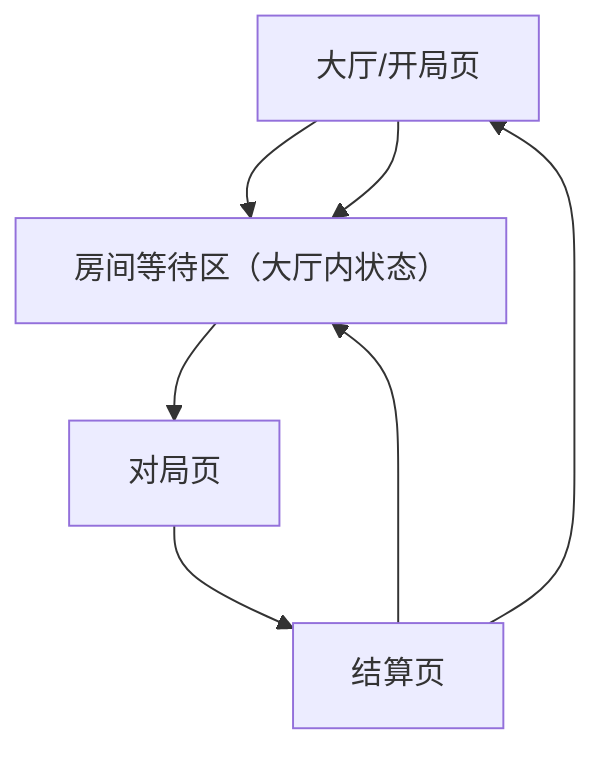

## 1. 产品概述
A3 项目对局体验 PRD：在现有“大厅→对局→结算”基础上，新增“大厅邀请他人进房”联机开局能力。
目标：你可以创建房间并分享链接/邀请码，好友加入后由房主开始；支持 1 人以上开局，未满 4 人由 AI 补位。

## 2. 核心功能

### 2.1 用户角色
本阶段不区分用户角色：玩家进入大厅即可开局。

### 2.2 功能模块（页面）
1. **大厅/开局页**：模式入口、创建房间、加入房间（链接/邀请码）、房间等待区（成员列表/准备状态/邀请信息）、房主开始。
2. **对局页**：牌桌布局、叫分/抢地主、出牌/不要/提示、回合计时、局势信息、动效与音效开关。
3. **结算页**：胜负结果、关键数据、再来一局（原房间/新房间策略见边界）、返回大厅。

### 2.3 页面详情
| 页面名 | 模块 | 功能描述 |
|---|---|---|
| 大厅/开局页 | 模式入口 | 展示可进入的对局模式（最少 1 个）；选择后用于创建房间的默认模式 |
| 大厅/开局页 | 创建房间 | 点击创建后生成房间并进入“房间等待区”；展示房间邀请码与可分享邀请链接 |
| 大厅/开局页 | 分享邀请 | 复制邀请链接（含房间标识）；复制邀请码（短码）；提供“已复制”轻提示 |
| 大厅/开局页 | 加入房间 | 通过粘贴邀请链接自动解析加入；或输入邀请码加入；加入成功进入“房间等待区” |
| 大厅/开局页 | 房间等待区 | 展示当前房间成员（最多 4 个槽位）：玩家头像/昵称（或游客名）/房主标识/AI 占位；展示房间状态（等待中/可开始） |
| 大厅/开局页 | 房主开始 | 仅房主可点击“开始”；当房间内真人玩家数 ≥1 时可开始；开始时若总人数未满 4，自动补齐 AI 后进入对局 |
| 大厅/开局页 | 退出房间 | 支持退出回到大厅；若房主退出，按边界规则处理房主转移/解散 |
| 对局页 | 牌桌主舞台 | 中央为本局关键状态（阶段/地主标识/底牌提示）；四人局时按四向布局展示头像与落牌区（或在三人布局基础上扩展一席位） |
| 对局页 | 手牌区（底部） | 支持点选/框选；已选牌高亮与上移；非法牌型即时提示并阻止出牌 |
| 对局页 | 操作按钮区 | 主要按钮：出牌、不要；次要：提示、托管（如有）；按钮随阶段启用/置灰 |
| 对局页 | 回合与计时 | 为当前行动方显示显著倒计时（数字+环形进度）；超时给出默认策略（不要/托管）；AI 自动行动不出现交互按钮 |
| 对局页 | 牌面呈现 | 出牌落点固定在玩家头像前；上一手牌保留到下一手出现；牌型名称短提示（如“顺子”） |
| 对局页 | 信息提示条 | 顶部轻提示：阶段切换（叫分/出牌）、倍数变化、异常提示（断线/重连中）、房间成员变动（加入/离开） |
| 结算页 | 结果主卡片 | 显示胜负、身份、倍数、总得分；区分真人与 AI 的数据标识（如“AI”标签） |
| 结算页 | 操作区 | 再来一局（主按钮）、返回大厅（次按钮）；联机房间内“再来一局”触发回到同一房间等待区并由房主再次开始 |

## 3. 核心流程
### 3.1 主流程（房主/受邀者）
- **房主流程**：进入大厅 → 选择模式 → 创建房间 → 复制邀请链接/邀请码并分享 → 等待好友加入（或不等）→ 点击开始 → 系统补齐 AI 至 4 人 → 进入对局 → 结算 → 回到房间等待区（再来一局）或返回大厅。
- **受邀者流程**：打开邀请链接（自动进入加入流程）或在大厅输入邀请码 → 加入房间等待区 → 等待房主开始 → 进入对局 → 结算 → 回到房间等待区或返回大厅。

### 3.2 关键规则与边界条件（必须明确）
1. **开局人数**：真人玩家数 **≥ 1** 即允许房主开始；开始瞬间将总座位补齐至 **4**（不足部分为 AI）。
2. **人数上限**：房间最多 **4 个座位**；满员时后续加入请求提示“房间已满”。
3. **加入时机**：房间状态为“对局中”时，新的加入请求提示“对局已开始，无法加入”。
4. **邀请码/链接有效性**：
   - 无法解析/无效码：提示“邀请码无效或已过期”，停留在加入区域。
   - 房间已解散：提示“房间不存在或已解散”，提供返回大厅。
5. **房主权限**：仅房主可开始/解散；非房主仅可退出。
6. **房主离开处理**：
   - **等待中**：房主退出时，若房内仍有真人玩家，房主自动转移给最早加入的真人玩家；若无真人玩家则解散房间。
   - **对局中**：房主掉线/退出按“断线/重连”策略处理（见第 7 条）；不因此终止对局。
7. **断线与重连（最小可行）**：检测到网络断开时显示“重连中”；重连成功后回到房间/对局当前状态；重连失败可退出回大厅。
8. **AI 补位锁定**：房主点击开始后立即锁定房间座位并补齐 AI；此后不再接受加入，避免座位冲突。
9. **重复加入**：同一设备/同一临时身份重复打开邀请链接时，若已在房间内则直接进入房间等待区。

**对局交互与可用性规范（关键）**
- 信息层级：先“轮到谁/还能做什么”（计时+按钮态）→ 再“对手出了什么”（牌面+牌型）→ 再“整体局势”（剩余牌数/倍数）。
- 触达效率：常用动作集中在右下（出牌/不要/提示）；所有次要入口收拢为图标（设置/托管）。
- 防错：不允许提交非法牌型；按钮置灰必须同时给出原因（短提示 1.5s）。
- 可读性：关键数字（倒计时/剩余牌数/倍数）字号 ≥ 正文 1.2 倍；对比度满足暗底亮字。

**动效规范（节奏参考欢乐斗地主）**
- 发牌：200–300ms/张，末张略停顿（80–120ms）强调“发完”。
- 选牌：上移 8–12px + 120ms ease-out；取消同速回落。
- 出牌：240–320ms 从手牌飞到落点，落地轻弹（缩放 1.02→1.0）。
- 阶段切换：顶部提示条淡入淡出（150ms/150ms），不遮挡按钮。

