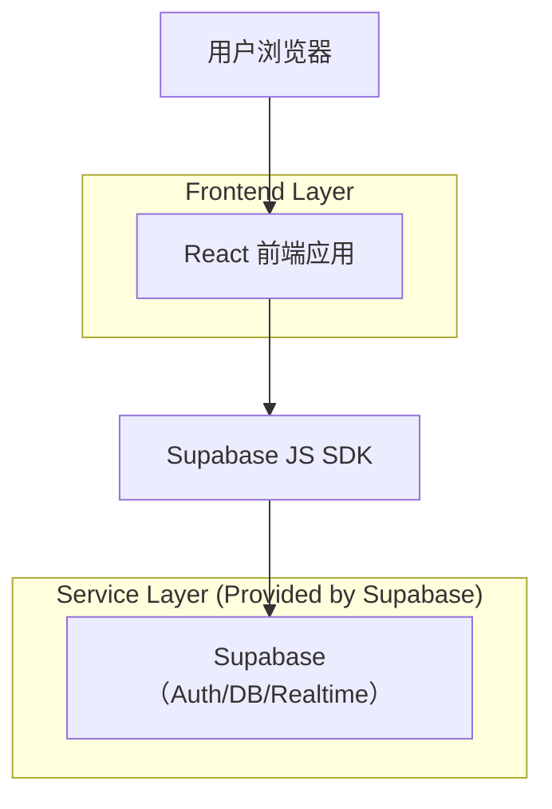
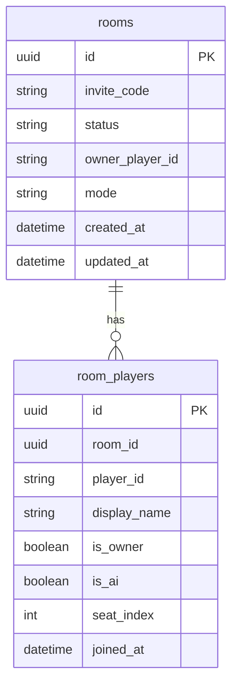

## 1.Architecture design


## 2.Technology Description
- Frontend: React@18 + react-router-dom@7 + zustand@5 + tailwindcss@3 + vite@6 + TypeScript@5
- Backend: Supabase（PostgreSQL + Realtime；用于房间创建/加入/成员同步）
- Auth: 暂不强制登录（以“临时游客身份”+ 设备本地持久化标识为主）；如后续需要防刷/封禁，可接入 Supabase Auth

## 3.Route definitions
| Route | Purpose |
|---|---|
| / | 大厅/开局页：模式入口、创建房间、加入房间、房间等待区（未显式 roomId 时） |
| /room/:roomId | 通过邀请链接直达房间等待区；展示邀请码/成员列表/房主开始 |
| /game/:roomId | 对局页：同一房间内的牌桌交互与回合流程 |
| /result/:roomId | 结算页：结果与再来一局/回房间等待区 |

## 4.API definitions
无（当前不包含后端服务）。

## 6.Data model(if applicable)

### 6.1 Data model definition


### 6.2 Data Definition Language
Rooms（rooms）
```
CREATE TABLE rooms (
  id UUID PRIMARY KEY DEFAULT gen_random_uuid(),
  invite_code VARCHAR(12) UNIQUE NOT NULL,
  status VARCHAR(20) NOT NULL DEFAULT 'waiting' CHECK (status IN ('waiting','locked','in_game','closed')),
  owner_player_id VARCHAR(64) NOT NULL,
  mode VARCHAR(32) NOT NULL DEFAULT 'classic',
  created_at TIMESTAMPTZ NOT NULL DEFAULT NOW(),
  updated_at TIMESTAMPTZ NOT NULL DEFAULT NOW()
);

CREATE TABLE room_players (
  id UUID PRIMARY KEY DEFAULT gen_random_uuid(),
  room_id UUID NOT NULL,
  player_id VARCHAR(64) NOT NULL,
  display_name VARCHAR(32) NOT NULL,
  is_owner BOOLEAN NOT NULL DEFAULT FALSE,
  is_ai BOOLEAN NOT NULL DEFAULT FALSE,
  seat_index INTEGER NOT NULL,
  joined_at TIMESTAMPTZ NOT NULL DEFAULT NOW()
);

CREATE INDEX idx_room_players_room_id ON room_players(room_id);
CREATE UNIQUE INDEX uniq_room_players_room_player ON room_players(room_id, player_id);
CREATE UNIQUE INDEX uniq_room_players_room_seat ON room_players(room_id, seat_index);

-- 权限（原型期最小可用；可后续收紧为 RLS）
GRANT SELECT ON rooms TO anon;
GRANT SELECT ON room_players TO anon;
GRANT ALL PRIVILEGES ON rooms TO authenticated;
GRANT ALL PRIVILEGES ON room_players TO authenticated;
```
